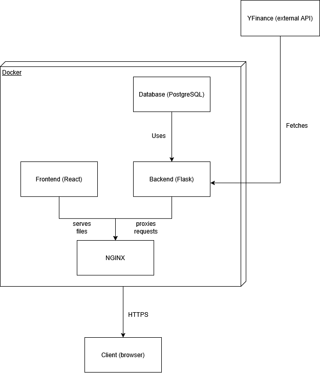
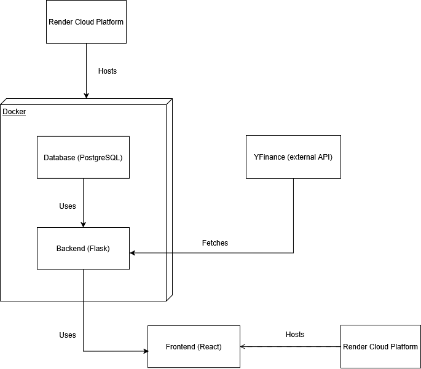
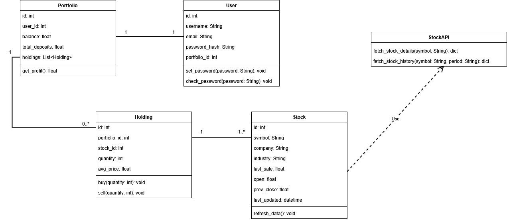

# Full Stack Paper Trading App
This app is designed to allow users to:
- simulate stock trading 
- view analytics of stocks
- view other users' portfolios
- view a leaderboard to see the ranks of all the users
- **Live version:** [https://paper-trading-app-zjpg.onrender.com/](https://paper-trading-app-zjpg.onrender.com/)
  - There are some issues fetching stock data on the server due to the external API yfinance. The external API is open source and meant for personal use, so the deployed server gets blocked sometimes.
  - Testing it locally works 100% however

## Demo video
**Demo on localhost**: [https://youtu.be/r5PAdysW9wM](https://youtu.be/r5PAdysW9wM)

## Local Setup (Docker)
1. Download the **main branch** a zip file and extract
2. Open the terminal, cd into the paper-trading-app folder
3. In the terminal, run: docker-compose up --build
4. When the build completes, open https://localhost (this is the frontend)
  - **If running on windows**, I recommend using Chrome/Edge to access https://localhost
    - Firefox may give you trouble (502 gateway error) because of the self-signed certs. I did some research and saw that it's likely due to SSL/TLS inspection from Microsoft Defender. Chrome/Edge rely on Windows Certificate Store, and bypasses this issue.

## Endpoints

### Health Route

**GET /health**  
Returns `{"status": "ok"}`.

### Auth Routes

#### POST /auth/register  
Create a new user.  
Body: `{username, email, password}`  
Responses:  
- 201 = user created  
- 400 = validation error  
- 409 = username/email already exists  

#### POST /auth/login  
Log in using username **or** email. Sets access + refresh cookies.  
Body: `{identifier, password}`  
Responses:  
- 200 = success  
- 400 = validation error  
- 401 = bad credentials  

#### POST /auth/refresh  
Refresh access token using refresh cookie.

#### POST /auth/logout  
Clears JWT cookies.

#### GET /auth/check  
Checks if the user is authenticated.  
Returns `{authenticated: true/false}`.

#### DELETE /auth/account/delete  
Deletes the authenticated user.  
Responses:  
- 200 = deleted  
- 404 = user not found  

#### PUT /auth/account/update  
Update username, email, or password.  
Body: `{username, email, new_password, current_password}`  
Responses:  
- 200 = updated  
- 400 = validation error  
- 401 = incorrect password  
- 409 = username/email taken  

### Trading Routes

#### GET /api/portfolio  
Returns the user’s portfolio including updated holdings.

#### POST /api/holding/buy  
Buy a stock.  
Body: `{stock_id, quantity}`  
Responses:  
- 200 = success  
- 400 = invalid quantity / insufficient funds  
- 404 = stock or portfolio not found  
- 503 = price unavailable  

#### GET /api/holding/stock/<stock_id>  
Get holding by stock ID.  
Responses:  
- 200 = success  
- 404 = not found  

#### POST /api/holding/sell  
Sell a stock.  
Body: `{stock_id, quantity}`  
Responses:  
- 200 = success  
- 400 = not enough shares / invalid quantity  
- 404 = stock or portfolio not found  
- 503 = price unavailable  

### Stock Routes

#### GET /api/stock/all  
Returns `{id, symbol, company}` for all stocks.

#### GET /api/stock/details/<symbol>  
Returns full stock details.  
Responses:  
- 200 = success  
- 404 = not found  

#### GET /api/stock/historical/<symbol>?period=<period>  
Returns historical price data.  
Responses:  
- 200 = success  
- 404 = symbol not found  
- 503 = data unavailable  

### Leaderboard

#### GET /api/leaderboard?page=&size=  
Returns ranked users by total portfolio value.  
Includes logged in user’s rank if available.  
Response fields: `page, size, total_pages, total_users, top_users, my_rank`

## Architechtural Design
This app follows a microservices architechture for the deployment. Frontend is served as a static site and backend is hosted on a separate server.

### Main branch Architechture
Note: the main branch works on localhost

### Render-deploy Branch Architechture
Note: the render-deploy branch is used for the live version.

### Backend/DB UML

## Tech Stack

### Frontend
React + TailwindCSS

### Backend
Flask + some helper libraries:
- SQLAlchemy
- Marshmallow
- flask-jwt-extended
- Werkzeug security
- yfinance (external API)

### Database
- PostgreSQL for DEV and PROD
- SQLite (in-memory) for unit tests

## Auth & Security
JWTs are used for authentication. Both access tokens and refresh tokens are used and stored in cookies for security (prevent XSS attacks).

## Testing & QA
Both unit tests and end-to-end tests were implemented. Pytest was used for unit tests and SeleniumBase was used for end-to-end.

## Deployment
To deploy this app, I had to make some modifications to the docker setup. I deployed it on a service called **Render** (free version).

I put the deployment code in the render-deploy branch. The docker setup on render-deploy differs from the main branch due to Render's configuration. On the live version the frontend is served as a static file, and the backend is served separately. On localhost, it's all runs together in the Dockerfile and uses NGINX to serve the frontend static files.

You can access it at this link:[https://paper-trading-app-zjpg.onrender.com/](https://paper-trading-app-zjpg.onrender.com/)